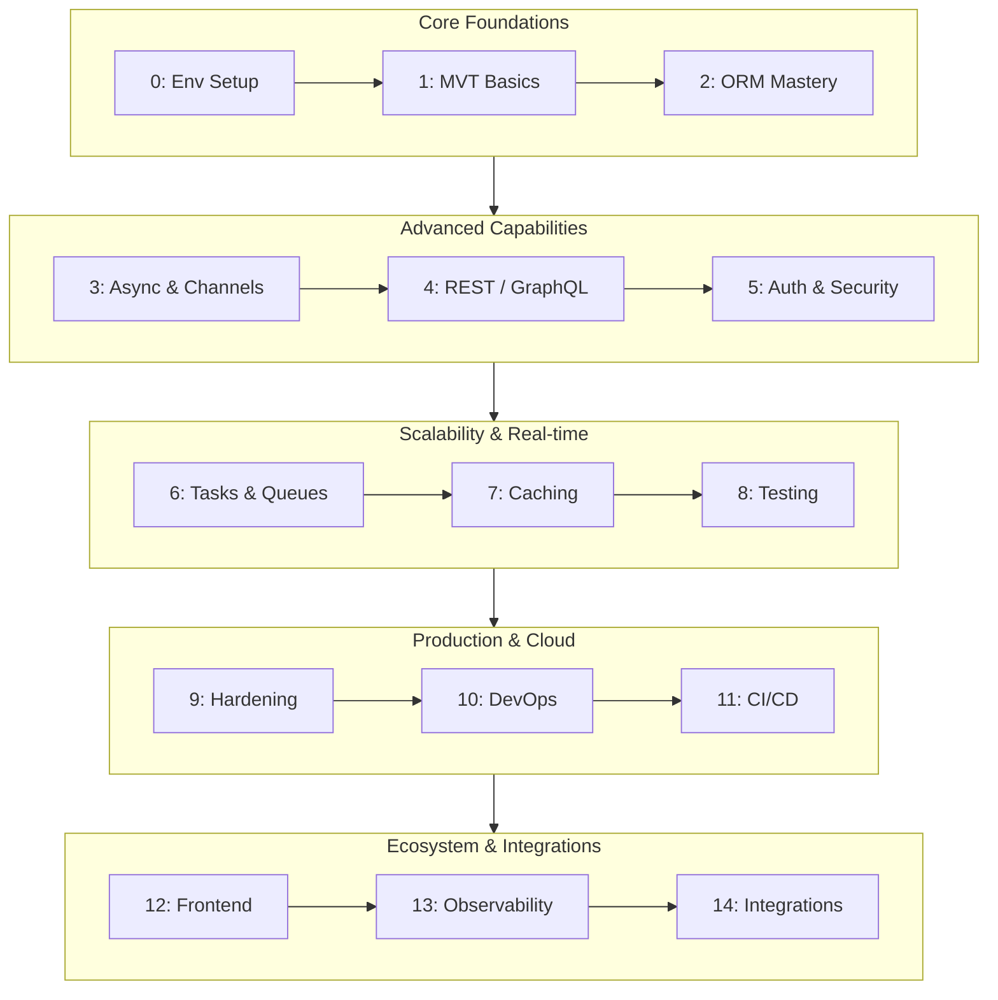

<div style="font-family: 'Segoe UI', Tahoma, Geneva, Verdana, sans-serif;">

<div align="center">
  <h1>Django: Basics to Pro Roadmap</h1>
  <p><i>A complete step-by-step guide from beginner to senior level</i></p>
  
  <br>
  
  <a href="https://skillicons.dev">
    <!-- Using only light theme icons that pop nicely on dark screens, no black icons -->
    
  </a>
</div>

<br>

First, take a look at the overall journey flow, then dive deep into each phase:



**How to Use:** Follow each phase sequentially. Build small projects to solidify your knowledge. Total 1200+ topics covered.

---


## Phase 0 — Foundations & Environment Setup (Beginner / Localhost Level)


<details>
<summary>Click to view topics</summary>


- Python 3.12/3.13/3.14 fundamentals (ref Django 6.0 supported versions)

- Virtual environments: `venv`, `virtualenv`, `uv`, `poetry`, `pipenv`, `hatch`, `pdm`

- `pyenv` & `pyenv-win` for multi-version Python

- Package managers compared: `pip` vs `uv` vs `poetry` vs `hatch`

- `pyproject.toml` modern Python packaging (PEP 621)

- `requirements.txt`, `requirements-dev.txt`, pinned vs loose versions

- `pip-tools`, `pip-compile`, `pip-sync` for deterministic locks

- Installing Django 6.0.7: `pip install Django==6.0.7`

- `django-admin startproject` & `startapp` anatomy

- Project vs app — when to split

- Settings: single `settings.py` → split `base/dev/prod` pattern

- Environment variables: `python-dotenv`, `django-environ`, `django-configuration`

- Secret management locally: `.env`, `direnv`, `pass`, `1Password CLI`

- `manage.py` commands deep dive: `runserver`, `shell`, `migrate`, `makemigrations`, `check`, `dbshell`, `test`, `collectstatic`

- `runserver` vs production servers (why not in prod)

- SQLite as default DB — when to move to Postgres

- Installing PostgreSQL + pgAdmin + `psql` locally

- Database drivers: `psycopg` (v3) vs `psycopg2-binary` vs `asyncpg`

- Redis install locally (cache, broker, channels layer)

- Docker & Docker Compose for local dev stack

- Devcontainer (VS Code) for reproducible env

- Editor setup: VS Code / PyCharm / Neovim — Django-specific extensions

- Linters/formatters: `ruff`, `black`, `isort`, `flake8`, `mypy`, `django-stubs`

- `pre-commit` hooks setup

- Python typing fundamentals for Django (`django-stubs`, `mypy` plugin)

- Project layout conventions: `config/`, `apps/`, `core/`, `static/`, `templates/`, `media/`

- Django release & support lifecycle understanding (LTS, EOL)

- Reading Django docs effectively (version switcher)

- Django forum, Discord, Reddit r/django community

- Django release notes reading habit (6.0, 6.1rc)

- Understanding WSGI vs ASGI from day one

- HTTP request/response lifecycle mental model

- `httpie` / `curl` / Postman / Bruno / Hoppscotch for API testing

- `.gitignore` for Django projects

- `.editorconfig`, `pyproject.toml` tooling config

- Time zones, `USE_TZ`, `TIME_ZONE` settings

- `LANGUAGE_CODE`, i18n prep

- `SECRET_KEY` generation & rotation

- `DEBUG=True` dangers

- `ALLOWED_HOSTS`, `INTERNAL_IPS`, `django-debug-toolbar` setup

- Logging config basics (`LOGGING` dict)

- `python -m http.server` vs Django dev server


</details>


---


## Phase 1 — Core Django Fundamentals (MVT Architecture)


<details>
<summary>Click to view topics</summary>


**Models (M):**

- `models.Model`, fields: `CharField`, `TextField`, `IntegerField`, `BooleanField`, `DateField`, `DateTimeField`, `DecimalField`, `FloatField`, `EmailField`, `URLField`, `UUIDField`, `SlugField`, `FileField`, `ImageField`, `BinaryField`, `JSONField`, `ArrayField` (PG)

- Field options: `null`, `blank`, `default`, `choices`, `verbose_name`, `help_text`, `unique`, `db_index`, `db_column`, `editable`, `validators`

- `TextChoices` / `IntegerChoices` enums

- Meta options: `ordering`, `verbose_name`, `db_table`, `indexes`, `constraints`, `unique_together`, `index_together` (deprecated), `abstract`, `managed`

- Relationships: `ForeignKey`, `OneToOneField`, `ManyToManyField` — `on_delete` options (`CASCADE`, `PROTECT`, `SET_NULL`, `SET_DEFAULT`, `DO_NOTHING`, `SET()`, `RESTRICT`)

- `related_name`, `related_query_name`, `limit_choices_to`

- Through models for M2M

- Self-referential relationships

- Generic relations (`GenericForeignKey`, `ContentType`)

- Model inheritance: abstract, multi-table, proxy

- `@property`, `@cached_property` on models

- Model methods: `__str__`, `__repr__`, `save()`, `delete()`, `full_clean()`, `clean()`, `clean_fields()`

- Signals: `pre_save`, `post_save`, `pre_delete`, `post_delete`, `m2m_changed`, `pre_init`, `post_init` — and why to avoid them

- `@receiver` decorators, `dispatch_uid`

- Custom managers & querysets (`Manager`, `QuerySet.as_manager()`)

- `Meta.constraints`: `UniqueConstraint`, `CheckConstraint`, `ExclusionConstraint`

- `db_index=True` vs `Meta.indexes`

- Migrations: `makemigrations`, `migrate`, `sqlmigrate`, `showmigrations`, `squashmigrations`

- Data migrations with `RunPython`, `RunSQL`, reverse functions

- Migration conflicts & merging

- `migrations.SeparateDatabaseAndState`

- Custom field types

- `pre_init`/`post_init` lifecycle

- Model `save()` override patterns & pitfalls

**Views (V):**

- Function-based views (FBV) — `HttpRequest`, `HttpResponse`, `render()`, `redirect()`, `get_object_or_404()`, `get_list_or_404()`

- Class-based views (CBV): `View`, `TemplateView`, `ListView`, `DetailView`, `CreateView`, `UpdateView`, `DeleteView`, `FormView`, `RedirectView`

- CBV mixins: `LoginRequiredMixin`, `PermissionRequiredMixin`, `StaffuserRequiredMixin`, `UserPassesTestMixin`

- Multiple mixins & MRO

- `dispatch()`, `get_queryset()`, `get_context_data()`, `get_object()`, `form_valid()`, `form_invalid()`

- `method_decorator`, `csrf_exempt`, `login_required`

- Generic relationships in views

- Decorators: `login_required`, `permission_required`, `user_passes_test`, `require_POST`, `require_GET`, `require_http_methods`, `cache_page`, `gzip_page`, `condition`, `etag`, `last_modified`

- Request/response objects: `GET`, `POST`, `FILES`, `META`, `COOKIES`, `session`, `headers`, `body`

- `StreamingHttpResponse`, `FileResponse`, `JsonResponse`, `HttpResponseNotAllowed`, `HttpResponseBadRequest`

- Middleware: built-in (`SecurityMiddleware`, `SessionMiddleware`, `CommonMiddleware`, `CsrfViewMiddleware`, `AuthenticationMiddleware`, `MessageMiddleware`, `XFrameOptionsMiddleware`) — writing custom middleware

- New-style async middleware (Django 6)

- `MIDDLEWARE` order matters

- `process_request`, `process_view`, `process_response`, `process_exception`, `process_template_response`

- Context processors

- Template rendering pipeline

**Templates (T):**

- DTL syntax: variables, tags, filters, comments

- Built-in tags: ``, ``, ``, ``, ``, ``, ``, ``, ``, ``, ``, ``

- Filters: `date`, `time`, `default`, `length`, `truncatewords`, `safe`, `escape`, `slice`, `join`, `add`, `slugify`, `urlencode`, `json_script`

- Template inheritance & block overriding

- Custom template tags & filters (`simple_tag`, `inclusion_tag`, `assignment_tag`, library)

- `get_template`, `select_template`, `render_to_string`

- Template loaders & dirs

- Jinja2 as alternative backend

- Context vs `RequestContext`

- Static files: ``, ``, `STATIC_URL`, `STATICFILES_DIRS`, `STATIC_ROOT`, `collectstatic`

- Media files: `MEDIA_URL`, `MEDIA_ROOT`

- `ManifestStaticFilesStorage` for cache-busting

- `whitenoise` for serving static in production

**URLs & Routing:**

- `path()`, `re_path()`, `include()`

- URL converters: `str`, `int`, `slug`, `uuid`, `path`

- Custom path converters

- `reverse()`, `reverse_lazy()`, ``

- Named URLs & namespaces

- `APPEND_SLASH`, `ROOT_URLCONF`

- Nested URL includes & app namespaces

**Forms:**

- `forms.Form` vs `forms.ModelForm`

- Field types & widgets

- `clean()`, `clean_<field>()`, validators

- Form rendering: `as_p`, `as_table`, `as_ul`, custom templates, `django-widget-tweaks`, `django-formtools`

- Formsets, modelformsets, inline formsets

- `crispy-forms`, `django-bootstrap5`

- File upload forms & validation

- Multiple file uploads

- Form widgets: `Select`, `RadioSelect`, `CheckboxSelectMultiple`, `DateInput`, `SplitDateTimeWidget`, custom widgets

- CSRF in forms

- `FormView` CBV integration

**Admin:**

- `admin.site.register`, `ModelAdmin`, `StackedInline`, `TabularInline`

- `list_display`, `list_filter`, `search_fields`, `readonly_fields`, `actions`, `date_hierarchy`

- Custom admin actions

- Admin site customization, `AdminSite`, multiple admin sites

- `django-admin-interface`, `django-grappelli`, `unfold` modern admin themes

- Admin permissions & `get_queryset` overrides

- Custom admin views & URLs


</details>


---


## Phase 2 — ORM & Database Mastery


<details>
<summary>Click to view topics</summary>


**Querysets deep dive:**

- Lazy evaluation & caching (`qs.query`, `._result_cache`)

- `filter()`, `exclude()`, `order_by()`, `distinct()`, `reverse()`, `none()`, `all()`

- Lookups: `exact`, `iexact`, `contains`, `icontains`, `startswith`, `istartswith`, `endswith`, `in`, `gt`, `gte`, `lt`, `lte`, `range`, `isnull`, `regex`, `iregex`, `date`, `year`, `month`, `day`, `week`, `week_day`, `quarter`, `time`, `hour`, `minute`, `second`

- `F()` expressions for atomic updates & comparisons

- `Q()` objects for complex OR/AND/NOT

- `annotate()`, `aggregate()`: `Count`, `Sum`, `Avg`, `Min`, `Max`, `StdDev`, `Variance`

- Conditional expressions: `Case`, `When`, `Value`

- `Func()` & custom DB functions

- `Subquery`, `Exists`, `OuterRef`

- `Prefetch()` & `prefetch_related` for optimized M2M/reverse

- `select_related` for FK/OneToOne

- `select_related` + `prefetch_related` combos & `Prefetch(..., queryset=...)`

- `only()`, `defer()`

- `iterator()`, `iterator(chunk_size=...)` for memory

- `bulk_create()`, `bulk_update()`, `bulk_create(..., ignore_conflicts=True, update_conflicts=True)` (Django 4.1+ upserts)

- `get_or_create()`, `update_or_create()`

- `in_bulk()`

- `values()`, `values_list()`, `flat=True`

- `dates()`, `datetimes()`

- `union()`, `intersection()`, `difference()` (set ops)

- `extra()` — discouraged but know it

- `raw()` SQL & `cursor.execute()`

- Connection management & `connections['default']`

- `transaction.atomic()`, `on_commit()`, savepoints

- Database transactions isolation levels

- `select_for_update()`, `select_for_update(skip_locked=True, of=...)`

- Optimistic concurrency, version fields

- N+1 query problem & detection

- `django-debug-toolbar` SQL panel

- `django-silk` profiling

- `django-extensions` `shell_plus`, `runserver_plus`, `print_settings`, `sqldsn`

**PostgreSQL-specific:**

- `ArrayField`, `HStoreField`, `JSONField` (cross-DB), `RangeField` types

- `UnaccentExtension`, `TrigramSimilarity`, `SearchVector`, `SearchQuery`, `SearchRank`, `SearchHeadline` (full-text search)

- ` GinIndex`, `GistIndex`, `BrinIndex`, `BTreeIndex`, `HashIndex`, `OpClass`

- `CreateExtension`, `AnyIndex`

- PostgreSQL partitioning & Django

- `django-postgres-extra` advanced features

- Connection pooling: `pgbouncer`, `PgCat`, Django `CONN_MAX_AGE`, `CONN_HEALTH_CHECKS`, `pgvector` for AI

- `psycopg` v3 connection pool

**MySQL/SQLite/MariaDB:**

- SQLite limitations & when to use

- SQLite WAL mode, `dqlite`

- MariaDB/MySQL specifics, `mysqlclient`

**Async ORM (Django 4.1+ → 6.0 expanded):**

- `aget()`, `acreate()`, `asave()`, `adelete()`, `aiterate()`, `acount()`, `aexists()`, `aget_or_create()`, `aupdate_or_create()`, `abulk_create()`, `abulk_update()`

- `async for obj in qs`

- Async querysets in async views

- Mixing sync/ORM in async context — `sync_to_async` / `database_sync_to_async`

- Limitations of async ORM (no lazy loading across boundary)

**Migrations advanced:**

- Squashing migrations

- Renaming models/fields safely

- Custom migration operations

- `RunPython` with `apps.get_model`

- Reversing & rolling back

- Zero-downtime migrations (expand-contract pattern)

- `django-migration-linter` to catch dangerous migrations

- `pgtrigger` for DB-level triggers


</details>


---


## Phase 3 — Async Django, Channels & Real-Time


<details>
<summary>Click to view topics</summary>


- WSGI vs ASGI deep dive

- `asgi.py` anatomy

- ASGI servers: `uvicorn`, `daphne`, `hypercorn` — comparison

- When to use which server (uvicorn prod, daphne dev)

- `async def view(request)` syntax

- `sync_to_async`, `async_to_sync`

- Async middleware (Django 6 improvements)

- Async ORM usage (cross-ref Phase 2)

- Async file I/O, async HTTP with `httpx` & `aiohttp`

- Async `EmailMessage` alternatives

- Running sync DB queries in async: `database_sync_to_async`

- `ASGIRequest` vs `HttpRequest`

- `ASGIHandler` lifecycle

- Channels layers: in-memory, Redis, Postgres channel layer

- `django-channels` install & `asgi.py` with `ProtocolTypeRouter`

- Consumers: `AsyncWebsocketConsumer`, `WebsocketConsumer`, `AsyncJsonWebsocketConsumer`

- `channel_layer.group_add`, `group_send`, `group_discard`

- Connecting/disconnecting handlers

- `receive()` handler

- Background worker via Channels

- `channels_redis` for production scaling

- WebSocket auth: query-token, cookie-based, `AuthMiddlewareStack`

- Real-time chat architecture

- Real-time notifications

- Presence/online status tracking

- Broadcasting to multiple instances (Redis pub/sub)

- `daphne` behind Nginx in production

- Scaling WebSockets horizontally (sticky sessions, Redis)

- SSE (Server-Sent Events) with Django — `django-eventstream`, streaming responses

- Long polling patterns

- WebRTC signaling server in Django

- gRPC / WebSocket gateways

- `granian` (Rust-based ASGI/WSGI server) — emerging 2026 option

- Connection pooling for async DB

- Async task offloading from async views

- Event-loop blocking detection: `aiomonitor`, `blocking_detector`

- Async testing with `pytest-asyncio`, `AsyncClient`

- `ASGITransport` for test client

- Mixing Celery + Channels + async views at scale

- Dragonfly as Redis alternative with Channels

- Real-time collaborative editing (OT/CRDT with Channels)

- Pusher / Ably / Soketi as managed real-time alternatives

- Rate limiting WebSockets

- WebSocket message queue patterns

- Backpressure handling

- Heartbeat/ping-pong

- Reconnection strategies client-side

- `centrifugo` integration for fan-out

- GraphQL Subscriptions over WebSocket

- `strawberry.subscriptions` with Channels


</details>


---


## Phase 4 — APIs: DRF, Django Ninja, GraphQL & API Design


<details>
<summary>Click to view topics</summary>


**REST & API Design:**

- REST principles, Richardson Maturity Model

- HTTP methods semantics (idempotency, safety)

- Status codes mastery (1xx–5xx)

- Resource modeling, naming conventions

- Versioning strategies: URL, header, accept-header, query param

- Pagination: page, limit-offset, cursor

- Filtering: query params, `django-filter`, `drf-spectacular` filters

- Sorting, sparse fieldsets

- HATEOAS

- Rate limiting & throttling

- API authentication: Basic, Token, JWT, OAuth2, API keys

- API key rotation & scoping

- Idempotency keys

- Webhooks design & signing (HMAC)

- Idempotent retries

- Bulk operations endpoints

- Soft deletes in APIs

- ETags & conditional requests

- Content negotiation

- CORS for APIs

- API documentation: OpenAPI 3.1, Swagger UI, ReDoc, `drf-spectacular`, `drf-yasg`

- Postman/Bruno/Hoppscotch collections

- API mocking with Prism / Mockoon

- Contract testing: Pact

- API gateways: Kong, APISIX, AWS API Gateway, Cloudflare

- BFF (Backend-for-Frontend) pattern

**Django REST Framework (DRF):**

- `Serializer` vs `ModelSerializer`

- `SerializerMethodField`, nested serializers, `depth`

- Validation: `validate()`, `validate_<field>()`, validators

- `ListSerializer`, `many=True`

- `HyperlinkedModelSerializer`

- `ViewSet`, `ModelViewSet`, `ReadOnlyModelViewSet`

- `Router` (Default, Simple)

- `APIView`, generics: `ListCreateAPIView`, `RetrieveUpdateDestroyAPIView`

- Mixins: `ListModelMixin`, `CreateModelMixin`, etc.

- Permissions: `IsAuthenticated`, `IsAdminUser`, `DjangoModelPermissions`, `DjangoObjectPermissions`, custom

- Authentication classes: `SessionAuthentication`, `TokenAuthentication`, `JWTAuthentication`, custom

- `djangorestframework-simplejwt` — access/refresh, rotation, blacklisting

- Throttling: `UserRateThrottle`, `AnonRateThrottle`, scoped

- Pagination classes

- Filtering: `DjangoFilterBackend`, `SearchFilter`, `OrderingFilter`

- `django-filter` advanced

- Renderers: JSON, BrowsableAPI, CSV (`drf-csv`), Excel (`drf-excel`), PDF

- Parsers: JSON, MultiPart, FileUpload

- Relations: `PrimaryKeyRelatedField`, `SlugRelatedField`, `HyperlinkedRelatedField`, `StringRelatedField`

- `drf-spectacular` schema generation, hooks, custom extensions

- `drf-nested-routers`

- `drf-writable-nested`

- `django-rest-polymorphic`

- `drf-flex-fields` sparse fieldsets

- Testing DRF: `APIClient`, `APITestCase`

- DRF + async views limitations (use Django Ninja for async)

**Django Ninja (modern, async-first, Pydantic-based):**

- Why Ninja in 2026 (async native, type-safe)

- `NinjaAPI` setup, routers

- Schema with Pydantic v2

- `@api.get/post`, path/query/body params

- `Schema`, `ModelSchema`, response models

- Auth: `HttpBasic`, `HttpBearer`, custom auth

- Pagination, filtering

- `django-ninja-jwt`

- `ninja-extra` (services, controllers, DI)

- OpenAPI auto-docs (Swagger/ReDoc built-in)

- Async endpoints with Pydantic

- File uploads

- CSRF with Ninja

- Migration DRF → Ninja strategy

**GraphQL:**

- Graphene-Django

- Strawberry (modern, type-hint based) — preferred 2026

- `strawberry-django` integration

- Types, queries, mutations, resolvers

- N+1 in GraphQL & `DataLoader`

- Subscriptions over WebSocket

- Federation / schema stitching

- Apollo / urql clients

- GraphQL auth (JWT, directives)

- Rate limiting GraphQL (query complexity, depth)

- Persisted queries

- GraphQL vs REST vs gRPC trade-offs

**gRPC / Message-based:**

- `grpcio`, `betterproto`, protobuf definitions

- Async API spec (AsyncAPI) for event-driven contracts


</details>


---


## Phase 5 — Authentication & Authorization (Auth Level Learning)


<details>
<summary>Click to view topics</summary>


**Built-in auth:**

- `User` model — default vs custom user (`AbstractUser`, `AbstractBaseUser`, `BaseUserManager`)

- Always start with custom user model (best practice)

- `AUTH_USER_MODEL`

- `authenticate()`, `login()`, `logout()`

- `login_required`, `LoginRequiredMixin`

- Session-based auth: `SessionMiddleware`, session engine (db, cache, file, signed cookies)

- Password hashing: `PBKDF2`, `Argon2`, `bcrypt` — `PASSWORD_HASHERS`

- Password validators: `UserAttributeSimilarityValidator`, `MinimumLengthValidator`, `CommonPasswordValidator`, `NumericPasswordValidator`, custom

- Password reset flow (`django.contrib.auth.views`)

- Password change flow

- `PasswordResetTokenGenerator`

- Email verification / activation

- Registration: `django-allauth`, `django-registration`

- `django-allauth` deep dive — social, email, MFA, account stages

**Social auth:**

- `django-allauth` social providers (Google, GitHub, Facebook, Apple, Twitter/X, LinkedIn, Microsoft, GitLab, Discord, Slack)

- `python-social-auth` alternative

- OAuth1 vs OAuth2 flows

- OpenID Connect (OIDC)

- SSO with SAML (`python3-saml`, `djangosaml2`)

- SAML IdP / SP

- Keycloak / Authentik / Auth0 / Okta / Clerk / Supabase Auth / FusionAuth as external IdP

- JWT vs opaque tokens

- `djangorestframework-simplejwt` — access, refresh, sliding, rotating tokens

- `djangorestframework-simplejwt` blacklisting & rotation

- Token revocation strategies

- Redis-based session/token store

- Stateless vs stateful auth trade-offs

- `dj-rest-auth` (DRF auth endpoints)

- Cookie-based JWT (httponly, secure, samesite)

**MFA & advanced:**

- TOTP 2FA (`django-otp`, `pyotp`, `django-two-factor-auth`)

- Backup codes

- SMS OTP (Twilio, Vonage)

- Email OTP

- WebAuthn / Passkeys (`django-webauthn`, `fido2`) — 2026 standard

- Biometric auth flow

- Step-up authentication

- Device trust / "remember this device"

- Magic link login

- Passwordless auth

**Authorization:**

- Django permissions system (`add`, `change`, `delete`, `view` per model)

- Custom permissions in `Meta.permissions`

- Groups

- `has_perm`, `has_module_perms`

- Object-level permissions (`django-guardian`, `rules`)

- `django-guardian` deep dive

- `rules` rule-based authorization

- RBAC (Role-Based Access Control) design

- ABAC (Attribute-Based Access Control)

- Policy as code: OPA (Open Policy Agent), Cedar, `cedar-py`

- Multi-tenant authorization

- Row-level security (DB RLS + Django)

- Feature flags for gated access (`django-flags`, `Unleash`, `LaunchDarkly`, `PostHog flags`)

- Session fixation, session expiry, concurrent session control

- Brute force protection: `django-axes`, `django-defender`

- Account lockout policies

- CAPTCHA: `django-simple-captcha`, `django-recaptcha`, hCaptcha, Turnstile

- Bot detection

- Audit logging for auth events

- SSO identity propagation to microservices

- OAuth2 server (make your Django an IdP) — `django-oauth-toolkit`

- OIDC provider with `mozilla-django-oidc`

- SCIM provisioning (`django-scim2`)

- Just-in-time (JIT) provisioning

- Token introspection endpoint

- JWKS endpoint

- Service-to-service auth (mTLS, JWT)

- API key management (`django-rest-framework-api-key`)

- Scoped tokens

- Impersonation (`django-impersonate`)

- Security headers for auth (CSP, HSTS, X-Content-Type-Options)


</details>


---


## Phase 6 — Real-Time, Background Tasks & Queues


<details>
<summary>Click to view topics</summary>


- Why background tasks: offloading from request cycle

- Django 6 built-in `django.tasks` framework — API only, no worker

- `@task` decorator, `enqueue()`, task status, results

- `django.tasks` backends — when to use, limitations (no scheduling/retries/persistence yet)

- When `django.tasks` is NOT enough → Celery

- **Celery** architecture: broker, worker, beat, result backend

- Celery brokers: Redis, RabbitMQ, Amazon SQS, Kafka

- Result backends: Redis, DB, RPC, Django ORM, Elasticsearch

- `@shared_task`, `@app.task`, `bind=True`

- Task states: PENDING, STARTED, SUCCESS, FAILURE, RETRY, REVOKED

- Retries: `autoretry_for`, `max_retries`, `retry_backoff`, `retry_jitter`

- `countdown`, `eta`

- `task_queues`, routing, priorities

- Celery Beat: periodic scheduling (`crontab`, `schedule`)

- `django-celery-beat` dynamic schedules in DB

- `django-celery-results` result storage

- `django-celery-monitoring` / Flower for monitoring

- Canvas: `group`, `chain`, `chord`, `chunks`

- Idempotent task design

- Dead letter queues

- Long-running tasks & progress tracking

- Task prioritization & fair scheduling

- Worker concurrency models: prefork, eventlet, gevent, solo

- Resource limits per worker

- `celery -A proj worker -l info` ops

- Autoscaling workers

- Queue separation by task type

- **RQ (Redis Queue)** & `django-rq` — simpler alternative

- **Django Q2** — Django-native queue

- **Huey** alternative

- **Dramatiq** — robust alternative to Celery

- **RQ vs Celery vs Dramatiq vs Huey** comparison

- Task idempotency with Redis locks (`redis.lock`)

- Distributed locks: Redlock, `django-redis` lock

- Cron alternatives: `APScheduler`, system cron, Kubernetes CronJob

- Webhooks processing pipeline

- Email queue: `django-celery-email`, `anymail`

- Image/video processing pipelines (Pillow, ffmpeg)

- Report generation (PDF/Excel) in background

- Bulk import/export jobs

- Scheduled data sync

- Event-driven architecture with queues

- Outbox pattern for reliable event publishing

- Saga pattern for distributed transactions

- Idempotency keys for tasks

- Task observability: Flower, Celery Exporter + Prometheus

- Sentry integration for task failures

- Task replay & reprocessing

- Backpressure & rate limiting tasks

- Queue poison message handling

- Workflow orchestration: Celery canvas vs Temporal vs Prefect

- **Temporal** integration for durable execution

- **Prefect** / **Dagster** for data pipelines

- Event streaming with Kafka (`confluent-kafka`, `aiokafka`)

- RabbitMQ exchanges: direct, topic, fanout, headers

- Message ordering guarantees

- Exactly-once vs at-least-once delivery

- Dead-letter & retry topics

- Schema registry (Avro/Protobuf) for messages

- Stream processing with `faust` / `bytewax`


</details>


---


## Phase 7 — Caching & Performance Engineering


<details>
<summary>Click to view topics</summary>


- Caching philosophy & cache hierarchies

- Django cache framework: backends — `LocMemCache`, `FileBasedCache`, `MemcachedCache`, `PyLibMCCache`, `RedisCache`

- `django-redis` vs `django-redis-cache` vs built-in `RedisCache` (Django 4+)

- Cache methods: `get`, `set`, `add`, `get_or_set`, `get_many`, `set_many`, `delete`, `incr`, `decr`, `touch`, `ttl`

- `@cache_page`, `@cache_control`, `@vary_on_headers`, `@vary_on_cookie`, `@never_cache`

- Template fragment caching ``

- Low-level cache API

- Per-site cache middleware (`UpdateCacheMiddleware`, `FetchFromCacheMiddleware`)

- Queryset caching: `cached_property`, `django-cacheops`

- `django-cacheops` automatic ORM caching & invalidation

- Cache key design & namespacing

- Cache stampede & prevention (locks, `get_or_set` jitter)

- Thundering herd problem

- Cache invalidation strategies (TTL, event-driven, version bump)

- Cache-aside vs read-through vs write-through vs write-back

- Multi-level caching: in-process (LRU) → Redis → DB

- `cachetools`, `async-lru` for in-process

- CDN caching: Cloudflare, CloudFront, Fastly, BunnyCDN

- Edge caching with Cloudflare Workers / Vercel Edge

- HTTP caching headers: `Cache-Control`, `ETag`, `Last-Modified`, `Vary`, `Age`, `Expires`

- Conditional requests (304 Not Modified)

- Surrogate-control & `Cache-Tags` (Fastly) for selective purge

- Redis data structures beyond cache: sorted sets, hyperloglog, streams, pub/sub

- Redis pub/sub for cache invalidation across instances

- Redis cluster & sharding

- Redis persistence (RDB/AOF)

- Redis Sentinel for HA

- Memcached vs Redis

- Connection pooling tuning

- Gzip/Brotli compression middleware

- Static file optimization: `ManifestStaticFilesStorage`, WhiteNoise

- Image optimization & responsive images, WebP/AVIF

- Lazy loading images

- Database optimization recap (Phase 2): indexes, prefetch, `only`/`defer`

- `EXPLAIN ANALYZE` for queries

- pg_stat_statements for slow query analysis

- Profiling: `django-silk`, `pyinstrument`, `cProfile`, `line_profiler`, `memray`

- `django-debug-toolbar` in dev

- APM: New Relic, Datadog, Scout, Blackfire, Pyroscope

- Frontend performance: Core Web Vitals, Lighthouse

- Critical CSS, defer/async scripts

- HTTP/2 & HTTP/3 (QUIC) with Nginx/Cloudflare

- Brotli compression

- Resource hints: `preload`, `prefetch`, `preconnect`, `dns-prefetch`

- Prefetch cache warming

- Async I/O for I/O-bound views (Phase 3)

- Worker/process tuning: Gunicorn workers/threads, Uvicorn workers

- `gevent`/`eventlet` monkey-patching

- Connection reuse: `CONN_MAX_AGE`, `persistent_connections`

- PgBouncer transaction pooling

- Read replicas & routing reads

- Database sharding strategies

- Materialized views in Postgres

- Denormalization for read performance

- Counter cache pattern

- Pagination performance (cursor vs offset)

- Avoiding `count(*)` on large tables

- Background precomputation of aggregates

- Edge Side Includes (ESI)

- Service Worker caching (PWA)

- Lazy module imports to speed boot

- `uvloop` for asyncio performance

- `httptools`, `orjson` for faster JSON

- Benchmarking with `wrk`, `vegeta`, `k6`, `locust`

- Continuous benchmarking in CI


</details>


---


## Phase 8 — Testing & Quality Assurance


<details>
<summary>Click to view topics</summary>


- Django test framework: `TestCase`, `TransactionTestCase`, `SimpleTestCase`, `LiveServerTestCase`

- `django.test.Client`, `AsyncClient`, `RequestFactory`

- Test fixtures: JSON, YAML, `django-fixturetools`

- `pytest-django` setup & migration from `unittest`

- `pytest` fixtures, `conftest.py`, scopes, parametrize

- `factory_boy` factories for models

- `mixer`, `model_bakery` for fast object creation

- `freezegun` / `time-machine` for time-dependent tests

- `responses` / `httpx_mock` / `aioresponses` for HTTP mocking

- Mocking: `unittest.mock`, `pytest-mock`, `monkeypatch`

- Database test isolation, `KEEP_DB`, `--reuse-db`

- Coverage: `coverage.py`, `pytest-cov`, branch coverage

- Coverage gates in CI (e.g., 90%)

- Mutation testing: `mutmut`, `cosmic-ray`

- Property-based testing: `Hypothesis` for Django models/views

- Snapshot testing: `syrupy`, `pytest-insta`

- API contract testing: Pact, Schemathesis (OpenAPI fuzzing)

- Load testing: `locust`, `k6`, `vegeta`, `wrk`

- Stress & soak testing

- End-to-end (E2E): Playwright, Selenium, Cypress

- Visual regression: Percy, Playwright snapshots

- Browser testing in CI (headless Chrome)

- Email testing: `locmem` backend, `django-mail-Tester`, MailHog/Mailpit

- Testing Celery tasks: `eager` mode, `celery-sqlalchemy-fixtures`, `pytest-celery`

- Testing Channels: `ChannelsLiveServerTestCase`, `websocket` client

- Testing async views: `AsyncClient`, `pytest-asyncio`

- Testing migrations: `django-test-migrations`, forward/reverse

- Testing signals

- Testing middleware

- Testing permissions

- Testing file uploads & media

- Testing with multiple DBs

- Test settings split (`test.py`)

- `pytest-xdist` parallel tests

- `pytest-randomly` for order randomization

- Flaky test detection & retry

- Code quality: `ruff`, `flake8`, `pylint`, `bandit` (security)

- Type checking: `mypy` + `django-stubs`, `pyright`

- `django-stubs` strict mode

- Pre-commit hooks in CI

- Linting templates: `djlint`

- Linting migrations: `django-migration-linter`

- Dependency audit: `pip-audit`, `safety`, `dependabot`, `renovate`

- License compliance: `pip-licenses`

- SBOM generation: `cyclonedx-py`

- Static analysis: `Semgrep`, `CodeQL`

- SAST/DAST in CI

- Secret scanning: `gitleaks`, `trufflehog`

- Test data privacy (GDPR-safe fixtures)

- Performance regression tests

- Database state cleanup strategies

- Test pyramid & testing strategy

- BDD: `behave-django`, `pytest-bdd`

- Accessibility testing: `axe-core`, `pa11y`

- i18n testing

- Mutation score gates

- TDD discipline

- Golden master tests

- Chaos testing for distributed systems

- Test environment parity with prod (Docker)


</details>


---


## Phase 9 — Security Hardening


<details>
<summary>Click to view topics</summary>


- `manage.py check --deploy` — run before every deploy

- OWASP Top 10 mapping to Django

- **SQL Injection**: ORM protection, raw SQL dangers, `params`

- **XSS**: auto-escaping, `mark_safe` dangers, CSP

- **CSRF**: `CsrfViewMiddleware`, tokens, SameSite cookies

- **SSRF**: validating outbound URLs, allowlists

- **Clickjacking**: `XFrameOptionsMiddleware`, CSP `frame-ancestors`

- **Insecure Deserialization**: `pickle` dangers, signed cookies

- **Broken Access Control**: object perms, IDOR prevention

- **Security Misconfiguration**: DEBUG, ALLOWED_HOSTS, HSTS

- **Sensitive Data Exposure**: HTTPS, TLS, secrets mgmt

- **Vulnerable Components**: `pip-audit`, Renovate

- **Auth failures**: covered in Phase 5

- **Logging & Monitoring failures**: Phase 13

- **Server-Side Request Forgery** (SSRF) deep dive

- **Mass assignment** prevention in serializers/forms

- **Insecure Direct Object Reference** (IDOR)

- **HTTP Host header attacks**

- **Open redirects** prevention

- **Path traversal** in file handling

- **Zip bombs**, malicious uploads

- **HTTP method tampering**

- **Cookie security**: `HttpOnly`, `Secure`, `SameSite=Strict/Lax/None`

- **Session security**: rotation on login, expiry, fixation

- **Password storage**: Argon2id recommended

- **Secrets management**: Vault, AWS Secrets Manager, Doppler, Infisical

- **Content Security Policy**: `django-csp`, nonce-based, report-only

- **CORS**: `django-cors-headers`, strict allowlists

- **HSTS**, `SECURE_HSTS_SECONDS`, preload

- **X-Content-Type-Options: nosniff**

- **X-Permitted-Cross-Domain-Policies**

- **Referrer-Policy**

- **Permissions-Policy** (formerly Feature-Policy)

- **COOP, COEP, CORP** for isolation

- **Subresource Integrity (SRI)**

- **TLS/SSL**: Let's Encrypt, certbot, auto-renewal

- **mTLS** for service-to-service

- **Rate limiting**: `django-ratelimit`, `django-brake`, DRF throttling, Cloudflare

- **WAF**: Cloudflare, AWS WAF, ModSecurity

- **Bot protection**: Turnstile, hCaptcha

- **DDoS protection**

- **Brute force**: `django-axes`, `django-defender`

- **2FA enforcement** (Phase 5)

- **Audit logging**: `django-auditlog`, `django-easy-audit`, `django-simple-history`

- **PII handling & GDPR**: right to erasure, data export

- **Encryption at rest**: DB encryption, field-level encryption (`django-fernet-fields`, `django-encrypted-model-fields`)

- **Encryption in transit**

- **Key rotation**

- **Backups security** (encrypted backups)

- **Dependency scanning in CI**

- **Container image scanning**: Trivy, Grype, Snyk

- **SBOM & supply chain**: SLSA, sigstore

- **Penetration testing** basics

- **Bug bounty** program setup

- **Incident response** runbook

- **Security headers testing**: securityheaders.com

- **SSL Labs** grade A+

- **CSP reporting** endpoint

- **MIME sniffing** prevention

- **Click injection** & tapjacking

- **Prototype pollution** (less relevant Python but API consumers)

- **GraphQL introspection** disabling in prod

- **API key leakage** detection

- **JWT security**: `alg=none`, weak secrets, kid traversal

- **Secure file uploads**: content-type sniffing, antivirus (ClamAV), sandboxing


</details>


---


## Phase 10 — Deployment & DevOps (Production Level)


<details>
<summary>Click to view topics</summary>


**Servers:**

- WSGI servers: Gunicorn, uWSGI — config tuning

- ASGI servers: Uvicorn, Daphne, Hypercorn, Granian

- Gunicorn worker models: sync, threads, gevent, eventlet, uvloop

- `workers` vs `threads` formula (`(2*CPU)+1`)

- `max_requests`, `max_requests_jitter`, `timeout`, `graceful_timeout`

- Gunicorn socket vs TCP

- Uvicorn with `--workers`, `--loop uvloop`, `--http httptools`

- Running WSGI + ASGI together (Gunicorn + Uvicorn workers)

- `daphne` for WebSocket traffic

**Reverse proxy:**

- Nginx config: `proxy_pass`, `upstream`, buffering, timeouts

- Nginx for static/media serving

- Nginx WebSocket proxying (`Upgrade`/`Connection` headers)

- Nginx rate limiting (`limit_req`)

- Nginx TLS, OCSP stapling, HTTP/2, HTTP/3

- Caddy (auto-HTTPS) as modern alternative

- Traefik for container environments

- HAProxy for L4/L7 load balancing

**Docker:**

- `Dockerfile` best practices for Django (multi-stage, slim, non-root)

- `.dockerignore`

- Layer caching for `requirements` install

- `uv` for fast installs in Docker

- Docker Compose for local + simple prod

- Healthchecks & depends_on conditions

- Image size optimization (`dive`, `slim.ai`)

- Distroless & scratch images

- Image tagging & registry (GHCR, Docker Hub, ECR)

- Image signing: cosign

**Orchestration:**

- Kubernetes basics for Django

- Helm charts

- K8s Deployments, Services, Ingress, ConfigMaps, Secrets

- HPA (Horizontal Pod Autoscaler), VPA, KEDA

- K8s liveness/readiness probes

- K8s CronJob for Celery Beat

- Managed K8s: EKS, GKE, AKS, DigitalOcean DOKS

- `kompose` Compose → K8s

- `kustomize` vs Helm

- ArgoCD / Flux GitOps

- Skaffold dev loop

**PaaS / Serverless:**

- Heroku, Railway, Render, Fly.io, DigitalOcean App Platform

- AWS Elastic Beanstalk

- Google Cloud Run (container serverless)

- AWS Lambda + `zappa` / `mangum` ASGI adapter

- Azure Container Apps

- Vercel/serverless edge for Django (limitations)

- Cloudflare Workers + Django backend

**CI/CD:**

- GitHub Actions workflows for Django

- GitLab CI, CircleCI, Jenkins

- Build, test, lint, type-check, security scan stages

- Docker build & push in CI

- Deploy strategies: blue-green, canary, rolling

- Feature flags for safe rollout

- Rollback procedures

- Database migration in deploy pipeline (migrate as separate job)

- Zero-downtime deploys

- `release` stage with `manage.py check --deploy`

- Secret injection in CI

- OIDC to cloud (no long-lived keys)

- Attestations & SLSA

**IaC:**

- Terraform for AWS/GCP/Azure

- OpenTofu (Terraform fork)

- Pulumi (Python IaC)

- Ansible for config mgmt

- CloudFormation / CDK

**Networking:**

- VPC, subnets, security groups

- Private subnets for DB

- NAT gateways

- Load balancers: ALB, NLB, GLB

- CDN integration

- DNS: Route53, Cloudflare

- WAF at edge

**Ops:**

- Runbooks & on-call

- Backups & restores (DB + media)

- Disaster recovery, RTO/RPO

- Multi-region deployment

- Blue-green DB cutovers


</details>


---


## Phase 11 — Git/GitHub Workflow (GitHub Level Learning)


<details>
<summary>Click to view topics</summary>


- Git internals: objects, refs, index, HEAD

- `git init`, `clone`, `add`, `commit`, `status`, `log`, `diff`

- Branching models: GitFlow, GitHub Flow, Trunk-Based, GitLab Flow

- `git checkout -b`, `switch`, `restore`

- Merging vs rebasing

- `git rebase -i` interactive rebase

- Squash commits

- `git cherry-pick`

- `git stash`, `stash pop`

- `git reflog` — undo anything

- `git reset` (soft/mixed/hard) vs `revert`

- Force push safely (`--force-with-lease`)

- Tags: annotated vs lightweight, semver

- `.gitignore`, `.gitattributes`

- LFS for large files

- Submodules vs monorepo

- Monorepo tools: Nx, Lerna (JS), Pants, Bazel (Python)

- Git hooks: `pre-commit`, `pre-push`, `commit-msg`

- Conventional Commits (`feat:`, `fix:`, `chore:`)

- Commitizen, semantic-release

- PR workflow: fork vs shared repo

- PR templates, CODEOWNERS

- Branch protection rules

- Required reviews, status checks

- Merge strategies: merge commit, squash, rebase

- GitHub Actions deep dive: workflows, jobs, steps, matrix, reusable workflows, composite actions

- Self-hosted runners

- GitHub Packages, GHCR

- GitHub Environments & deployment approvals

- GitHub Secrets & Variables

- OIDC federation to AWS/GCP/Azure

- Dependabot & Renovate for dependency updates

- GitHub Security: code scanning (CodeQL), secret scanning, Dependabot alerts

- GitHub Projects (v2) for planning

- GitHub Discussions

- GitHub Pages for docs

- GitHub Wikis vs docs in repo

- Release management: GitHub Releases, changelog automation

- `release-please`, `semantic-release`, `setuptools-changelog`

- Mirroring repos

- Git blame, `git bisect` for bug hunting

- `git worktree` for parallel branches

- Sparse checkout

- Partial clone (`--filter=blob:none`)

- Signed commits (`git commit -S`) with GPG/SSH/Age

- `gitleaks` pre-commit

- Pull request review etiquette

- Code review checklist

- Pair programming via Live Share

- Git aliases

- `tig`, `lazygit`, `gitui` TUI clients

- Resolving merge conflicts

- Cherry-picking hotfixes

- Long-running feature branches & rebase strategy

- Monorepo with Django multiple apps & CI matrix


</details>


---


## Phase 12 — Frontend Integration (Modern Django + JS)


<details>
<summary>Click to view topics</summary>


- Server-side rendering (SSR) with DTL — when it's enough

- **HTMX** deep dive: `hx-get/post/put/delete`, `hx-swap`, `hx-target`, `hx-trigger`, `hx-vals`, `hx-headers`, `hx-push-url`, `hx-select`, out-of-band swaps (`hx-swap-oob`)

- HTMX + Django patterns: partial templates, `HX-Request` header, `hx_redirect`

- `django-htmx` middleware & helpers

- HTMX extensions: `preload`, `sse`, `ws`, `morph`, `head-support`, `path-params`

- **Alpine.js** for client reactivity

- HTMX + Alpine combo patterns

- **Tailwind CSS**: install via `django-tailwind`, JIT, purge, plugins

- `django-tailwind` + browser sync

- Tailwind components: DaisyUI, Flowbite, PrelineUI, shadcn-style

- **Django + Vite**: `django-vite`, `django-vite-plugin`, hot module reload

- Vite + React / Vue / Svelte / Solid in Django templates

- `django-webpack-loader` (older approach)

- JSON-rendered React (`django-render`), Inertia.js (`django-inertia`)

- Inertia.js for SPA without API

- Next.js + Django API (separate frontend)

- SSR React with Next.js consuming Django REST

- GraphQL frontend with Apollo/urql

- Astro + Django headless

- Remix / React Router 7 with Django

- Hotwire/Turbo (Rails-style) in Django via `turbo-django`

- **Stimulus** + Turbo

- LiveView-style: `django-sockpuppet`

- Web Components with Django

- HTMX vs Alpine vs React trade-offs

- Design systems: shadcn/ui, Radix, Park UI

- Component libraries with Tailwind

- Icons: Heroicons, Lucide, `django-svg-icons`

- Forms: HTMX async validation, `django-formset` (2026 modern)

- File uploads with progress (HTMX/Alpine)

- Infinite scroll with HTMX

- Lazy loading partials

- Modal/drawer patterns server-rendered

- Toasts with HTMX

- Real-time UI updates via Channels + HTMX SSE

- SSE endpoint with `django-eventstream` + HTMX `sse` ext

- WebSockets + Alpine state sync

- Optimistic UI updates

- Offline-first with Service Workers

- PWA manifest & installability

- Push notifications (Web Push)

- Mobile-responsive patterns

- Dark mode / theme switching

- RTL support

- i18n on frontend (`django-i18n` + JS catalogs, `i18next`)

- Accessibility (ARIA, semantic HTML)

- Bundling & tree-shaking

- Source maps in prod

- CSP nonce-friendly bundling

- Image pipelines: `django-imagekit`, `easy-thumbnails`, `django-storages` with imgproxy

- Frontend testing: Vitest, Playwright

- Storybook for component dev

- Design tokens

- `htmx` + `select2` / `tom-select` autocomplete

- Rich text editors: Trix, TipTap, Quill, CKEditor, EasyMDE with Django

- Markdown rendering

- Code highlighting (Prism, Highlight.js, Shiki)

- Charts: Chart.js, ApexCharts, ECharts, Plotly with Django data

- Maps: Leaflet, Mapbox, `django-leaflet`

- Data tables: `django-tables2`, DataTables, Tabulator with HTMX


</details>


---


## Phase 13 — Observability, Monitoring & Logging


<details>
<summary>Click to view topics</summary>


- Three pillars: logs, metrics, traces

- Django logging config: loggers, handlers, formatters, filters

- Structured logging: `structlog`, `python-json-logger`, `django-structlog`

- Correlation IDs: `django-cid`, `asgi-correlation-id`

- Log levels & when to use

- PII scrubbing in logs

- Log aggregation: Loki, Elasticsearch/Logstash/Kibana (ELK), OpenSearch, Datadog Logs, Grafana Loki

- **OpenTelemetry** instrumentation for Django

- OTel traces → Tempo/Jaeger/Zipkin

- OTel metrics → Mimir/Prometheus

- OTel logs → Loki

- `opentelemetry-instrumentation-django`

- Auto-instrumentation vs manual spans

- Distributed tracing across Celery, Channels, HTTP calls

- **Sentry** for error tracking (Python SDK, Celery, Channels integrations)

- Sentry release health, source maps, session replay

- **Prometheus** metrics: `django-prometheus`, counters, histograms, gauges

- Custom business metrics

- RED method (Rate, Errors, Duration)

- USE method (Utilization, Saturation, Errors)

- SLI / SLO / SLA definition

- Error budget & burn rate alerts

- **Grafana** dashboards

- Grafana LGTM stack (Loki, Grafana, Tempo, Mimir)

- Beyla (eBPF auto-instrumentation)

- Alerting: Alertmanager, Grafana OnCall, PagerDuty, Opsgenie

- Uptime monitoring: Better Stack, UptimeRobot, Checkly

- Synthetic monitoring / probes

- RUM (Real User Monitoring): PostHog, Plausible, Umami, Matomo

- APM comparison: Datadog, New Relic, Dynatrace, Honeycomb, SigNoz, Elastic APM

- Profiling in prod: Pyroscope, Parca, `py-spy`, `austin`

- Memory profiling: `memray`, `tracemalloc`

- Slow query logging & pg_stat_statements

- N+1 detection: `django-debug-toolbar` (dev), `nplusone`

- Celery monitoring: Flower, Celery Exporter

- Redis monitoring: Redis Exporter, RedisInsight

- Postgres monitoring: `pg_stat_statements`, `pgBadger`, `postgres_exporter`, pgvector index health

- Nginx access logs → metrics

- Kubernetes monitoring: kube-state-metrics, node-exporter

- Cloud-native: AWS CloudWatch, GCP Cloud Operations, Azure Monitor

- Log retention policies

- Hot/warm/cold storage

- Audit log as separate stream

- Trace sampling strategies (head/tail-based)

- OpenMetrics format

- Cardinality explosion prevention

- Anomaly detection: ML-based alerting

- Incident management: incident.io, firehydrant, rootly

- Postmortems & blameless culture

- Status pages: Atlassian Statuspage, Better Stack, Cachet

- On-call rotations

- Runbooks as code (Robusta, kubectl plugins)

- Observability cost optimization

- Privacy: not logging secrets/tokens

- Compliance logging (PCI, HIPAA, SOC2)


</details>


---


## Phase 14 — Third-Party Integrations


<details>
<summary>Click to view topics</summary>


**Payments:**

- Stripe: `dj-stripe`, `stripe` Python SDK, Checkout, Payment Intents, webhooks, subscriptions

- PayPal

- Razorpay (PK/India)

- Braintree

- Mollie, Adyen, Square

- Paddle (MoR — Merchant of Record for tax)

- Crypto: Coinbase Commerce, NowPayments

- Apple Pay / Google Pay via Stripe

- Refunds, disputes, partial captures

- 3D Secure / SCA

- Tax: Stripe Tax, TaxJar, Avalara

- Invoicing: Stripe Invoicing, Xero/QuickBooks sync

**Email:**

- `django.core.mail`, SMTP backends

- `django-anymail`: SES, SendGrid, Mailgun, Postmark, Brevo, Resend, Mailchimp Transactional

- Resend (modern 2026 favorite)

- Postmark, SES with DKIM/SPF/DMARC

- Email templates (MJML, Premailer, inline CSS)

- `django-templated-email`

- Bounced email handling via webhooks

- Email suppression lists

- Domain authentication (SPF, DKIM, DMARC, BIMI)

- Cold email compliance (CAN-SPAM, GDPR)

**SMS / OTP:**

- Twilio, Vonage, Plivo, MessageBird

- WhatsApp Business API

- SMS fallback for 2FA

**Push:**

- Web Push (VAPID), `django-webpush`, `pywebpush`

- Firebase Cloud Messaging (FCM)

- APNs (Apple)

- OneSignal, Pusher Beams

- Push templates & rich notifications

**Storage / Files:**

- `django-storages`: S3, GCS, Azure Blob, Backblaze B2, Cloudflare R2

- S3 presigned URLs for direct upload

- `boto3` deep dive

- Cloudflare R2 (no egress fees) — 2026 popular

- Imgproxy / Cloudinary / Uploadcare for image processing

- Multipart uploads for large files

- Virus scanning uploads (ClamAV)

- Document previews (PDF.js, Gotenberg)

**Search:**

- Postgres full-text search (Phase 2)

- **Meilisearch** integration (`django-meilisearch`)

- **Typesense**

- **Elasticsearch** / OpenSearch with `django-haystack` / `django-opensearch-dsl`

- **Algolia** (`django-algolia-search`)

- **OpenSearch Serverless**

- Vector search: **pgvector**, **Qdrant**, **Weaviate**, **Milvus**, **Pinecone**, **LanceDB**

- Hybrid search (BM25 + vector)

**AI / LLM (Phase 20 has more):**

- OpenAI Python SDK

- Anthropic Claude SDK

- Google Gemini

- `django-ai-assistant`

- LangChain / LangGraph

- LlamaIndex for RAG

- Local LLMs via Ollama, vLLM

- Embeddings: OpenAI, Cohere, Voyage, Nomic, local BGE

- Speech: Whisper, ElevenLabs, Deepgram

- Image generation: DALL-E, Stable Diffusion, Flux

- AI gateway: LiteLLM, Portkey

**Maps / Geo:**

- Leaflet, Mapbox, Google Maps

- `django-leaflet`, `geodjango`

- PostGIS for geo queries

- Geocoding: Mapbox, Nominatim, Google

- Routing: OSRM, GraphHopper

**Analytics / Tracking:**

- Google Analytics 4 (GA4)

- PostHog (open-source product analytics + flags + session replay)

- Plausible / Umami / Matomo (privacy-friendly)

- Mixpanel, Amplitude

- Hotjar, Microsoft Clarity for heatmaps

- Segment / RudderStack CDP

- Server-side tracking via Measurement Protocol

- Consent management (CookieYes, OneTrust, Termly)

**Communication / Collaboration:**

- Slack SDK & webhooks

- Discord bots

- Telegram bots (`python-telegram-bot`)

- Microsoft Teams

- Zoom / Google Meet integrations


</details>


---


## Phase 15 — Advanced Architecture & Patterns


<details>
<summary>Click to view topics</summary>


- Layered architecture: views → services → repositories → models

- Service layer pattern in Django (`django-service-objects`, `ninja-extra` services)

- Repository pattern with Django ORM

- Domain-Driven Design (DDD) in Django: aggregates, entities, value objects, repositories, domain events

- Hexagonal / Ports & Adapters

- Clean Architecture with Django

- CQRS in Django (separate read/write models)

- Event Sourcing

- Outbox pattern for reliable events

- Saga pattern for distributed transactions

- **Multi-tenancy**: shared DB shared schema, shared DB separate schema, DB-per-tenant

- `django-tenancy`, `django-tenant-schemas`

- Row-level multi-tenancy with tenant_id

- Tenant-aware caching, queues, search

- Tenant onboarding & migrations

- Plugin architecture: `django-pluggy`, `django-bitfield`, app registry patterns

- Modular monolith (Django apps as modules)

- **Microservices** with Django: when & how to split

- Service boundaries (bounded contexts)

- Inter-service communication: REST, gRPC, async messaging

- API gateway / BFF

- Service mesh: Istio, Linkerd, Consul

- Shared DB anti-pattern & alternatives

- Database-per-service

- **Event-driven architecture**: Kafka, NATS, RabbitMQ, Pulsar

- Pub/sub vs message queue vs stream

- Event schema evolution (Avro, Protobuf, JSON Schema)

- Schema registry

- **Workflow orchestration**: Temporal, Cadence, Prefect, Dagster, Airflow

- Idempotency across services

- Distributed transactions: 2PC, Saga, Outbox

- Eventually consistent systems

- Caching patterns revisited at scale

- Materialized views & CQRS read models

- Backend-for-Frontend (BFF) per client

- Strangler Fig pattern for legacy migration

- Anti-corruption layer

- Cell-based architecture (AWS cell model)

- Sharding patterns: hash, range, geographic

- Consistent hashing

- Database connection sharing & pooling across services

- Shared auth service (SSO) for microservices

- Service discovery: DNS, Consul, K8s services

- Circuit breakers: `pybreaker`, `tenacity`

- Retries with backoff & jitter

- Bulkheads & rate limiting

- Timeouts at every layer

- Graceful degradation

- Feature toggles architecture (`django-flags`, Unleash, LaunchDarkly, PostHog)

- A/B testing infrastructure

- Multi-region active-active vs active-passive

- Data residency & geo-routing

- Compliance-aware architecture (GDPR, CCPA, PCI, HIPAA, SOC2)

- Cost-aware architecture (FinOps)

- Documentation: ADRs (Architecture Decision Records), C4 model, PlantUML


</details>


---


## Phase 16 — Scalability & High Availability


<details>
<summary>Click to view topics</summary>


- Vertical vs horizontal scaling

- Stateless app servers

- Load balancing: L4 vs L7, algorithms (round-robin, least-conn, consistent hash)

- Sticky sessions & why to avoid

- Session externalization (Redis)

- Database read replicas & routing (`db-router`)

- Primary/replica replication, lag handling

- Connection pooling: PgBouncer, PgCat, Pgpool

- Database sharding with `django-db-sharding`, Citus

- Citus (distributed Postgres) for horizontal scale

- CockroachDB / YugabyteDB for distributed SQL

- Aurora Serverless, AlloyDB, Neon, Supabase

- Caching layer scaling (Redis cluster)

- CDN strategy for static & dynamic

- Edge compute (Cloudflare Workers, Vercel Edge, Lambda@Edge)

- Queue scaling: Celery autoscale, KEDA, separate worker pools

- Async I/O for concurrency (Phase 3)

- Worker process tuning revisited

- Backpressure & queue depth alerts

- Circuit breakers & bulkheads

- Rate limiting at edge (Cloudflare, WAF)

- Global traffic management (Route53 latency-based, Cloudflare load balancing)

- Multi-AZ deployment

- Multi-region active-active

- Database multi-region (Citus, CockroachDB, Aurora Global)

- Cache warming & invalidation across regions

- Queue federation across regions

- Disaster recovery: RTO/RPO, backups, PITR

- Point-in-time recovery (Postgres PITR)

- Backup testing & restore drills

- Chaos engineering: Gremlin, Chaos Mesh, Litmus

- Capacity planning & forecasting

- Performance budgets

- Cost optimization (FinOps): right-sizing, savings plans, spot instances

- Spot/preemptible instances for workers

- Autoscaling policies (HPA, KEDA, ALB target tracking)

- Predictive autoscaling

- Slow start & cold starts

- Connection draining

- Health checks & self-healing

- Zero-downtime deploys (blue-green, canary)

- Shadow traffic & dark launches

- Load testing at scale (k6, locust, vegeta, Artillery)

- Soak & stress tests

- Capacity headroom

- Bottleneck identification (Universal Scalability Law)

- Amdahl's & Gunther's laws

- Database optimization recap (Phase 2 & 7)

- Asynchronous everywhere (async views, tasks, queues)

- Caching everywhere (browser → CDN → app → DB)


</details>


---


## Phase 17 — Cloud, SRE & Infrastructure as Code


<details>
<summary>Click to view topics</summary>


- AWS core services for Django: EC2, ECS, EKS, Fargate, Lambda, RDS, ElastiCache, S3, CloudFront, ALB, SQS/SNS/Kinesis, SES, Secrets Manager

- GCP: Cloud Run, GKE, Cloud SQL, Memorystore, Cloud Storage, Cloud CDN, Pub/Sub

- Azure: App Service, AKS, Azure DB for Postgres, Azure Cache, Blob, Front Door

- Region & AZ selection

- VPC design, subnets, NAT, peering

- IAM least privilege, roles, OIDC federation

- Secrets: AWS Secrets Manager, GCP Secret Manager, Azure Key Vault, Doppler, Infisical, HashiCorp Vault

- **Terraform**: state, modules, workspaces, `tfvars`, remote state (S3+DynamoDB)

- OpenTofu (fork) — 2026 Linux Foundation backed

- Pulumi (Python IaC)

- CDK (AWS/GCP)

- Ansible for config management

- Packer for golden images

- Helm charts deep dive

- Kustomize overlays

- ArgoCD / Flux GitOps

- Crossplane (K8s-native IaC)

- Fleet/Cluster API

- Service mesh: Istio, Linkerd, Cilium

- Ingress controllers: Nginx Ingress, Traefik, Envoy, ALB

- Cert-manager for TLS

- ExternalDNS

- Cluster autoscaler, Karpenter

- GPU node pools for AI workloads

- Spot instances with interruption handling

- Cost visibility: Kubecost, CloudHealth, Vantage

- SRE practices: SLO/SLI, error budgets, toil reduction

- Incident command system

- On-call rotations & follow-the-sun

- Runbooks & automation

- ChatOps (Robusta, BotKube)

- Postmortems (blameless)

- Change management & CAB

- Release engineering

- Configuration management: env-specific configs

- Feature environments (preview envs per PR) — ephemeral

- Shift-left security in IaC (`tfsec`, `checkov`, `kics`)

- Drift detection

- Policy as code: OPA Gatekeeper, Kyverno

- Compliance automation (SOC2, PCI, HIPAA, ISO 27001)

- Data residency controls

- Encryption: KMS, CMK, envelope encryption

- Network security: security groups, NACLs, PrivateLink

- VPN/Direct Connect

- Observability infra (recap Phase 13)

- Log/trace/metric pipelines as code

- Backup automation & verification

- DR drills & game days

- Cost anomaly detection

- Sustainability (carbon-aware computing)


</details>


---


## Phase 18 — Social Features, Analytics & Tracking


<details>
<summary>Click to view topics</summary>


- Social auth (Phase 5 recap)

- User profiles & avatars (Gravatar, DiceBear, uploaded)

- Friend/follow systems (asymmetric vs symmetric)

- Activity feeds (fan-out on write vs fan-out on read)

- Newsfeed ranking algorithms

- Likes, reactions, bookmarks

- Comments & threaded replies (`django-mptt`, `django-treebeard`, `django-comments-xtd`, Closure tables)

- Mentions (@user) & hashtags

- Notifications center (in-app, email, push) — `django-notifications-hq`, custom

- Real-time presence (Phase 3)

- Direct messaging / chat (Channels)

- Group chats & channels

- Content moderation: word filters, image moderation (AWS Rekognition, OpenAI moderation, Hive)

- Report/flag system

- Trust & safety workflows

- Rate-limiting user actions

- Anti-spam (Akismet, reCAPTCHA, Turnstile)

- Sharing: OG tags, Twitter Cards, social share buttons

- Open Graph & Twitter meta tags

- Embeds (YouTube, X, TikTok, Instagram)

- Invite/referral systems

- Leaderboards & gamification (Redis sorted sets)

- Badges & achievements

- Streaks

- Social proof widgets

- **Analytics tracking**: event taxonomy

- Server-side tracking (Segment, RudderStack, PostHog)

- GA4 Measurement Protocol

- Conversion funnels

- Cohort analysis

- Retention curves

- A/B testing (PostHog, GrowthBook, Unleash)

- Feature flag analytics

- Heatmaps (Hotjar, Clarity)

- Session replay (PostHog, FullStory, LogRocket)

- User identity resolution

- Privacy: consent management (GDPR, CCPA, DPDP)

- Cookie consent banners (CookieYes, OneTrust, Termly)

- Anonymization & pseudonymization

- Data export (GDPR Article 20)

- Right to erasure flows

- Analytics warehouses: BigQuery, Snowflake, Redshift, ClickHouse

- Reverse ETL (Hightouch, Census)

- Customer Data Platform (CDP) — Segment, RudderStack, mParticle

- Marketing automation (HubSpot, Customer.io, Loops.so)


</details>


---


## Phase 19 — Production-Grade Portfolio Projects


<details>
<summary>Click to view topics</summary>


Build these to internalize everything — each should be production-deployed, tested, monitored, documented:


- **P-Final-1: SaaS Subscription Platform** — multi-tenant, Stripe billing, RBAC, audit log, feature flags, full observability.

- **P-Final-2: Real-time Collaboration Tool** (Notion-lite) — Channels + CRDT, presence, offline-first PWA.

- **P-Final-3: E-commerce Marketplace** — multi-vendor, payments, search (Meilisearch + pgvector), inventory via event sourcing.

- **P-Final-4: AI-powered Knowledge Base** — RAG with pgvector/LangChain, streaming responses (SSE), agent tools.

- **P-Final-5: Live Streaming / WebRTC Platform** — signaling, recording, HLS via Channels.

- **P-Final-6: FinTech Dashboard** — PCI-aware, immutable ledger, audit, multi-region DR.

- **P-Final-7: Healthcare Portal** — HIPAA, encryption at rest, audit log, consent flows.

- **P-Final-8: EdTech LMS** — courses, quizzes, SCORM, analytics, gamification.

- **P-Final-9: Job Board / ATS** — social auth, CV parsing AI, search, webhooks.

- **P-Final-10: IoT Data Platform** — MQTT broker → Kafka → Django ingestion, time-series (TimescaleDB), alerts.

- **P-Final-11: Headless CMS** — GraphQL + REST, multi-tenant, preview environments.

- **P-Final-12: Open-source Django Package** — publish to PyPI, docs (Sphinx/MkDocs), CI, semver, semantic-release.

Each project: ADRs, README, architecture diagram (C4), tests >90%, CI/CD, observability, security review, deployed on cloud, load-tested, with postmortem of one real incident.


</details>


---


## Phase 20 — Emerging & Future Topics (2026 → beyond)


<details>
<summary>Click to view topics</summary>


- **Django 6.1 / 7.0 roadmap** — track DEPs (Django Enhancement Proposals)

- `django.tasks` evolution → future worker, scheduling, retries, persistence

- Native async ORM full coverage

- Possible native REST/API story in Django

- **AI-native Django**: `django-ai-assistant`, agents, tool calling, MCP (Model Context Protocol) servers in Django

- **LLM agents** with LangGraph / LlamaIndex / CrewAI / AutoGen in Django

- RAG pipelines with pgvector / Qdrant / Weaviate

- Vector embeddings lifecycle (re-embedding, versioning)

- Streaming LLM responses via SSE / WebSocket

- Function/tool calling orchestration

- AI guardrails (NeMo Guardrails, Guardrails AI)

- LLM observability (Langfuse, Helicone, Arize Phoenix)

- Prompt management & versioning

- Fine-tuning vs RAG vs agents decision

- Local/on-prem LLMs (Ollama, vLLM, llama.cpp) for privacy

- Speech-to-text (Whisper), text-to-speech (ElevenLabs), voice agents

- Vision models (GPT-4o, Claude vision) in Django workflows

- **Edge computing**: Django on Cloudflare Workers (via ASGI adapters), Vercel Edge, Fastly Compute

- **WebAssembly (Wasm)**: Pyodide, running Python in browser; WASI server runtimes

- `granian` Rust ASGI server — emerging 2026

- `uv` ultra-fast Python (Astral) — package/install resolver

- `rye` / `astral-sh` ecosystem

- `ruff` replacing flake8/black/isort

- `ty` (Astral type checker) — 2026 emergence

- **Serverless Django**: AWS Lambda + Mangum, Cloud Run, Fly Machines, Modal

- Cold-start optimization for serverless Django

- Scale-to-zero & concurrency

- **Edge databases**: Turso (libSQL), Neon edge, Cloudflare D1 (limited Django compat)

- Distributed Postgres: CockroachDB, YugabyteDB, Citus, AlloyDB Omni

- **NewSQL & HTAP**: TiDB

- **Time-series**: TimescaleDB, InfluxDB, QuestDB, ClickHouse for analytics

- **Streaming SQL**: RisingWave, Materialize

- **Object storage evolution**: R2, B2, SeaweedFS, MinIO

- **GraphQL federation** with Strawberry

- **gRPC-Web** & Connect-RPC

- **AsyncAPI** for event-driven contract docs

- **OpenTelemetry** GenAI semantic conventions (LLM tracing)

- **Privacy-enhancing tech**: differential privacy, federated learning, secure enclaves

- **Post-quantum cryptography** prep (Kyber, Dilithium) — TLS migration

- **Passkeys / WebAuthn** as default auth (passwordless future)

- **MCP (Model Context Protocol)** servers — expose Django data to AI clients

- **AI gateways**: LiteLLM, Portkey, Helicone for multi-LLM routing

- **Local-first software** sync engines (ElectricSQL, PowerSync, Yjs) with Django backend

- **CRDT** libraries (Yjs, Automerge) for collaborative editing

- **Observability 3.0**: eBPF (Beyla), continuous profiling (Parca, Pyroscope)

- **Platform engineering**: Backstage, Port, Humanitec for Django internal developer platforms

- **Golden paths** & scaffolding templates (`cookiecutter-django` updated for 6.0)

- **Green computing**: carbon-aware scheduling

- **AI codegen** in Django dev workflow (Copilot, Cursor, Claude Code, Aider)

- **Spec-driven development**: OpenAPI/AsyncAPI → Django codegen

- Track Django DEPs, forum discussions, DjangoCon talks, Django News newsletter

- Track Python 3.13 free-threaded (no-GIL) mode & Django compatibility

- Track Python 3.14 JIT & Django perf

- Track `django-tasks` → potential native Celery replacement

- Track Django Software Foundation security advisories


</details>


---


<br>

## How to Contribute & Clone

If you want to contribute to this roadmap or use it locally, follow these steps:

1. **Clone the Repository:**
   ```bash
   git clone https://github.com/yourusername/django-roadmap-2026.git
   cd django-roadmap-2026
   ```

2. **Contributions:**
   - Fork the project.
   - Create a new branch (`git checkout -b feature/new-topic`).
   - Add your amazing topic.
   - Commit your changes (`git commit -m 'Add new topic'`).
   - Push to the branch (`git push origin feature/new-topic`).
   - Open a Pull Request!

<br>
<div align="center">
  <p><i>Keep Coding, Keep Scaling!</i></p>
</div>
</div>
